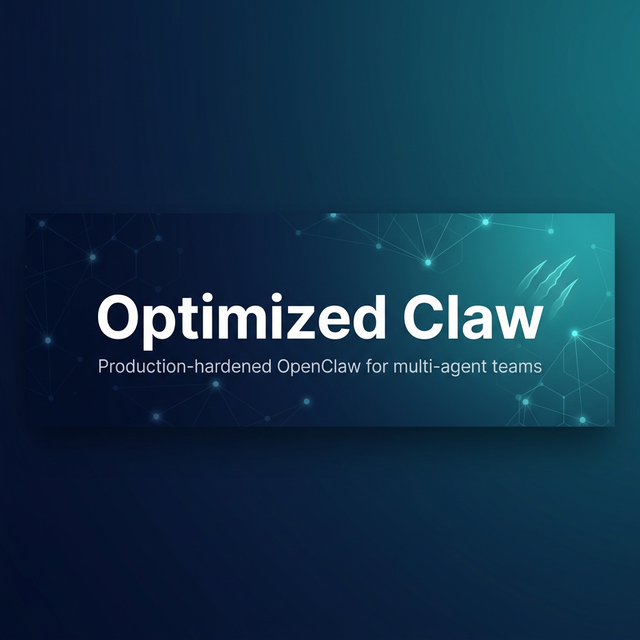

# Optimized Claw

<p align="center">
    
</p>

<p align="center">
  <strong>Production-hardened OpenClaw for multi-agent teams</strong>
</p>

<p align="center">
  <a href="LICENSE"></a>
  
  <a href="https://github.com/openclaw/openclaw"></a>
  <a href="https://openclawservers.com"></a>
</p>

---

## What is Optimized Claw?

**Optimized Claw** is a production-hardened fork of [OpenClaw](https://github.com/openclaw/openclaw) — the open-source personal AI assistant. It tracks upstream closely but ships battle-tested fixes, multi-agent structure, security hardening, and infrastructure improvements needed to run OpenClaw reliably in production with multiple agents.

Everything from upstream works as-is. Optimized Claw adds the layer on top: per-agent browser containers, autonomous consciousness loops, content security, memory improvements, Docker reliability fixes, and tooling that makes multi-agent deployments actually stable.

If you want a single-agent personal assistant, upstream OpenClaw is great. If you want to run a **team of agents** on a server, keeping them secure, self-aware, and structured for multi-agent operation — this fork is for you.

The public brand is **Optimized Claw**, but the runtime, CLI, package layout, and config paths stay `openclaw` for upstream compatibility.

---

## Best Fit

Optimized Claw is a better fit than stock upstream if you are:

- running multiple long-lived agents on one gateway
- deploying primarily with Docker or server-hosted infrastructure
- relying on per-agent browser isolation and scoped credentials
- wanting agents that autonomously self-improve, reflect, and maintain their own memory
- using upstream channels like Matrix/Element, Telegram, Discord, Slack, or WhatsApp but wanting a more production-oriented baseline
- keeping a fork in sync with upstream while preserving a known patch set

---

## What's Different from Upstream OpenClaw?

### 🔒 Security

| Feature                  | Description                                                                                                                                                                                    |
| ------------------------ | ---------------------------------------------------------------------------------------------------------------------------------------------------------------------------------------------- |
| [ACIP](ACIP_SECURITY.md) | Advanced Cognitive Inoculation Prompt — baked into every agent. Defends against prompt injection, data exfiltration, and instruction manipulation across all external content and tool outputs |
| Content Scanner          | Automatic content scanning with risk scoring on all external inputs (browser, web-fetch, cron). Scans everything agents touch from the outside world                                           |
| Data Classification      | Three-tier classification (Confidential / Internal / Public) with PII detection                                                                                                                |
| Event Logger             | Structured JSONL event logging with PII redaction, log rotation, and queryable history                                                                                                         |

### 🤖 Multi-Agent Architecture

| Feature                      | Description                                                                                                                                                                                         |
| ---------------------------- | --------------------------------------------------------------------------------------------------------------------------------------------------------------------------------------------------- |
| Structured Agent Workspaces  | Each agent gets a purpose-built directory layout (`memory/`, `knowledge/`, `skills/`, `diary.md`, `open-loops.md`, `IDENTITY.md`, etc.) seeded automatically at creation — no manual setup required |
| Per-Agent Browser Containers | Each agent gets a dedicated browser sandbox via Docker, not a shared browser                                                                                                                        |
| Per-Agent OAuth              | Removed credential inheritance — agents use only their own OAuth tokens                                                                                                                             |
| Autonomous Self-Improvement  | Each agent runs its own consciousness loop, self-review, deep review, and nightly innovation — standalone by default, not relying on external orchestration                                         |
| Pre-Seeded Cron Jobs         | 10 default cron jobs (reflection, maintenance, briefings, innovation, audits) automatically seeded per agent with `MAIN_ONLY_JOBS` filtering for sub-agents                                         |
| Browser-Only Sandbox Mode    | `browser-only` sandbox mode for agents that need browser access without full containers                                                                                                             |
| Agent Browser Routing        | `createBrowserTool()` passes `agentId` so agents route to their own containers                                                                                                                      |
| Per-Agent CLI Onboarding     | `--agent` and `--sync-all` flags for scoped credential setup                                                                                                                                        |

### 🧠 Consciousness & Memory

| Feature                                                      | Description                                                                                                                                |
| ------------------------------------------------------------ | ------------------------------------------------------------------------------------------------------------------------------------------ |
| 3-Tier Reflection System                                     | Self-review (12h), consciousness loop (5h default, dynamic via `NEXT_WAKE:`), deep-review (48h) — runs autonomously per agent              |
| [Honcho](https://github.com/plastic-labs/honcho) Integration | Long-term memory baked into Docker image — auto-installed when `HONCHO_API_KEY` is set, gives agents persistent cross-session memory       |
| Pre-Reset Memory Flush                                       | Deterministic memory flush before session reset — ensures no context is lost between compactions                                           |
| Trajectory Compression                                       | Smarter session context carryover — preserves first/last turns verbatim, compresses middle via key decisions, tool usage, and user intents |
| Session Search                                               | FTS5-powered keyword search across past conversations — complements embedding-based memory search                                          |
| Session Context Carryover                                    | Rolling `memory/session-context.md` persists context across session resets                                                                 |
| Skill Auto-Creation                                          | Agents create and manage their own skill documents autonomously in `workspace/skills/`                                                     |
| Knowledge Base Indexer                                       | Auto-scans `memory/knowledge/*.md` and builds a queryable `_index.md`                                                                      |
| Improvement Backlog                                          | Structured backlog system for self-generated improvement proposals with tiered triage (auto-implement / build-then-approve / propose-only) |
| Nightly Innovation                                           | 5-phase autonomous building cron (2 AM) with backlog integration — agents build improvements overnight                                     |
| Morning Briefing                                             | Personalized daily summary (8 AM) with backlog surfacing and correction-awareness                                                          |
| Weekly Self-Audit                                            | 21-question strategic audit feeding the improvement backlog                                                                                |
| Diary Archival & Continuity                                  | Automatic diary rotation with continuity summaries across archive boundaries                                                               |
| Auto-Tidy                                                    | Scheduled workspace cleanup — prunes stale entries from MEMORY.md, open-loops, self-review, session-context, and backlog                   |

### 🐳 Docker & Deployment

| Feature                   | Description                                                                                                              |
| ------------------------- | ------------------------------------------------------------------------------------------------------------------------ |
| CDP Host Header Fix       | `http.request()` workaround for Node.js `fetch()` silently dropping `Host` headers — without this, Docker hostnames fail |
| Honcho Plugin Pre-Bake    | Honcho memory plugin baked into Docker image with correct ownership — auto-activates when API key is provided            |
| Browser Startup Sweep     | Auto-updates stale browser containers on gateway boot                                                                    |
| Pre-Installed CLI Tooling | `ffmpeg`, `imagemagick`, `pandoc`, `yt-dlp`, `sqlite3`, `ripgrep`, and 15+ more tools baked into Docker image            |
| Diagnostics Toolkit       | System health checks: PID file, port reachability, error rate, disk space                                                |

### 🌐 Browser Control

| Feature                                                       | Description                                                                                                |
| ------------------------------------------------------------- | ---------------------------------------------------------------------------------------------------------- |
| [Camofox](https://github.com/nicedaycode/camofox) Integration | Browser camouflage baked into container images — realistic fingerprint spoofing for anti-detection         |
| Playwright Anti-Detection                                     | 8 evasion scripts covering `navigator.webdriver`, plugins, WebGL, `chrome.runtime`, iframe leaks, and more |
| Parallel Profile Listing                                      | `Promise.all` replaces serial `for` loop — prevents timeout cascades with multiple remote profiles         |
| Auto-Download Capture                                         | Browser downloads automatically route to per-agent workspace directories                                   |
| Profile Timeout Tuning                                        | Bumped from 3s to 5s for reliability with 5+ remote profiles                                               |
| Sandbox Browser API                                           | HTTP/WebSocket proxy with noVNC for browser container access                                               |

### ⚡ Performance & Reliability

| Feature                | Description                                                                             |
| ---------------------- | --------------------------------------------------------------------------------------- |
| Telegram Media Timeout | 15s timeout on media downloads prevents hung downloads from blocking groups             |
| Typing TTL Callback    | "⏳ Still thinking" feedback when LLM runs exceed the typing indicator TTL              |
| Heartbeat Tuning       | Default interval changed from 30m to 1h to reduce unnecessary wakeups                   |
| General Fixes          | Ongoing bug fixes, reliability improvements, and edge-case handling across the codebase |

### 🛠️ Agent Identity & Tooling

| Feature                    | Description                                                                                                                                                                     |
| -------------------------- | ------------------------------------------------------------------------------------------------------------------------------------------------------------------------------- |
| SOUL.md                    | Actionable identity framework — 3-tier reflection, Ouroboros ontological framing, 7 Biblical principles, Ship of Theseus protection. Not a philosophical essay — a constitution |
| IDENTITY.md                | Per-agent identity document — relationship model, personality traits, communication preferences, CRITICAL rules promoted from self-review patterns                              |
| System Prompt Enhancements | Architect-first thinking, stale identity nudges (72h mtime check), comprehensive tool guidance, human voice detection                                                           |
| SQL Tools                  | `sql_query` (read-only memory index) + `sql_execute` (read-write workspace databases)                                                                                           |
| Session Search Tool        | Agent-facing FTS5 search across past conversations                                                                                                                              |
| Skill Management Tool      | Autonomous skill CRUD with safety boundaries and human-authored protection                                                                                                      |

---

## Deployment Paths

Optimized Claw supports the same runtime surfaces as upstream OpenClaw, but the recommended fork install paths are:

- **Git checkout** for direct control and easy upstream syncs
- **GHCR images** for Docker deployments

If your deployment tooling pulls container images directly, point it at:

- `ghcr.io/ashneil12/optimized-claw:main`
- `ghcr.io/ashneil12/optimized-claw-browser:main`

If your workflow depends on Matrix/Element or other upstream channels, the existing upstream channel docs and setup flow still apply unless this fork explicitly documents an override.

---

## Fresh Install

### Self-Hosted: macOS / Linux

```bash
curl -fsSL https://raw.githubusercontent.com/ashneil12/optimized-claw/main/scripts/install.sh | bash
```

This installer now defaults to a **git checkout of this fork**, not a package-manager install.

### Self-Hosted: Windows

```powershell
iwr -useb https://raw.githubusercontent.com/ashneil12/optimized-claw/main/scripts/install.ps1 | iex
```

### Manual Source Install

Runtime: **Node ≥22**.

```bash
git clone https://github.com/ashneil12/optimized-claw.git
cd optimized-claw

pnpm install
pnpm build

pnpm openclaw onboard --install-daemon
pnpm openclaw gateway --port 18789 --verbose
```

Install note: the public brand is **Optimized Claw**, but the command stays `openclaw`. For this fork, prefer **git** or **Docker** installs. A plain `npm install -g openclaw` targets the upstream package unless you publish a separate forked npm package.

### Docker

```bash
docker compose up -d
```

Published images:

- `ghcr.io/ashneil12/optimized-claw:main`
- `ghcr.io/ashneil12/optimized-claw-browser:main`

---

## Upgrading from an Existing OpenClaw Setup

If your current OpenClaw setup is already stable and doing everything you need, you probably **do not** need to move.

Switch to Optimized Claw if you specifically want the fork-only behavior: multi-agent structure, browser-container hardening, consciousness loops, or the other production patches listed above.

### Existing Source Checkout

Safest path:

1. Back up `~/.openclaw`
2. Stop the currently running gateway/service
3. Clone this fork into a new directory
4. Build it and run onboarding/install-daemon from the new checkout
5. Run `openclaw doctor`
6. Restart the gateway from the new install

The runtime and config paths stay `openclaw` / `~/.openclaw`, so your existing configuration can carry over. That also means you should keep a backup before switching.

### Existing Docker Deployment

Update your image references to:

- `ghcr.io/ashneil12/optimized-claw:main`
- `ghcr.io/ashneil12/optimized-claw-browser:main`

Then pull and restart:

```bash
docker compose pull
docker compose up -d
```

### Existing npm Install

There is no direct fork-owned npm upgrade path yet. If you installed with `npm install -g openclaw`, you are still on the official package stream.

To move to this fork, reinstall via:

- the git-based installer above
- a manual source checkout
- Docker / GHCR images

---

## Staying in Sync with Upstream

Optimized Claw tracks `openclaw/openclaw` main branch. Custom patches are documented in:

- **[LOCAL_PATCHES.md](LOCAL_PATCHES.md)** — Critical patches with per-file verification commands
- **[OPENCLAW_CONTEXT.md](OPENCLAW_CONTEXT.md)** — Complete modification inventory with post-sync checklist
- **[OPENCLAW_CHANGELOG.md](OPENCLAW_CHANGELOG.md)** — Full history of every custom change with rationale

After every upstream sync:

```bash
# Quick verification that all patches survived
grep -c 'httpRequestWithHostOverride' src/browser/cdp.helpers.ts  # expect ≥ 1
grep -c 'Promise.all' src/browser/server-context.ts               # expect ≥ 1
grep -c 'agentId.*resolveSessionAgentId' src/agents/openclaw-tools.ts  # expect ≥ 1
```

---

## Configuration

Optimized Claw uses the same configuration as upstream OpenClaw. See:

- [Full configuration reference](https://docs.openclaw.ai/gateway/configuration)
- [Getting started guide](https://docs.openclaw.ai/start/getting-started)
- [Channel setup](https://docs.openclaw.ai/channels)

Fork-specific additions are documented in `OPENCLAW_CONTEXT.md`.

### Fork-Specific Environment Variables

These environment variables control features unique to Optimized Claw. Set them in your `docker-compose.yml` or shell environment:

| Variable                         | Default | Description                                                                                                                                                                            |
| -------------------------------- | ------- | -------------------------------------------------------------------------------------------------------------------------------------------------------------------------------------- |
| `OPENCLAW_BUSINESS_MODE_ENABLED` | `0`     | Enable Business Mode — transforms the agent into a strategic business partner with a 22KB guide and 64 knowledge documents across strategy, content, copywriting, operations, and more |
| `HONCHO_API_KEY`                 | —       | Your [Honcho](https://github.com/plastic-labs/honcho) API key. When set, the Honcho memory plugin is auto-installed, giving agents persistent cross-session long-term memory           |
| `OPENCLAW_HUMAN_MODE_ENABLED`    | `0`     | Enable human voice mode — makes agent communication more natural and conversational                                                                                                    |

---

## Credits

Optimized Claw is built on top of [OpenClaw](https://github.com/openclaw/openclaw) by Peter Steinberger and the OpenClaw community. All upstream contributors are recognized.

Many improvements in this fork were inspired by ideas and techniques shared across the AI agent community on Twitter/X. If you recognize a contribution that hasn't been credited, please reach out via [@ashneil12](https://twitter.com/ashneil12) and appropriate attribution will be added.

- [OpenClaw](https://github.com/openclaw/openclaw) — upstream project
- [OpenClaw Docs](https://docs.openclaw.ai) — documentation (applies to this fork)
- [OpenClaw Servers](https://openclawservers.com) — managed hosting

## License

[MIT](LICENSE) — same as upstream OpenClaw.
